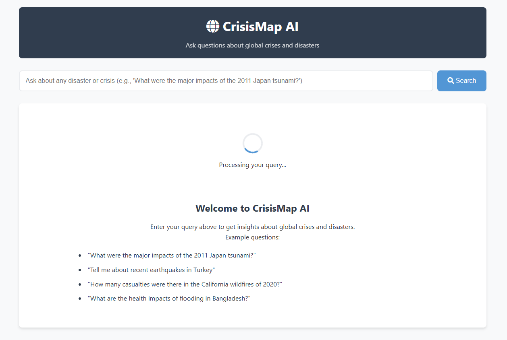
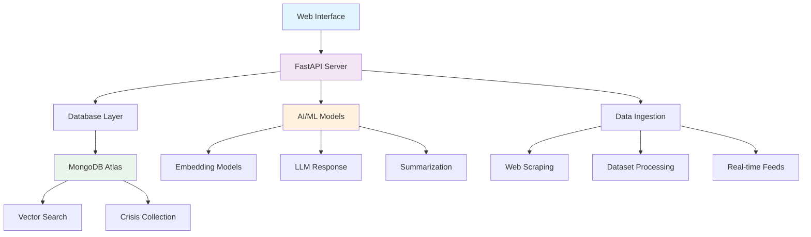

# CrisisMap AI

<div align="center">



[](https://github.com/Mukprojects/CrisisMap_AI/releases)
[](https://www.python.org/)
[](LICENSE)
[](https://github.com/Mukprojects/CrisisMap_AI/actions)
[](https://github.com/Mukprojects/CrisisMap_AI)
[](https://github.com/Mukprojects/CrisisMap_AI)

**Advanced Crisis Monitoring and Detection Platform**

*Leveraging AI, vector search, and real-time data ingestion to provide actionable insights on global crises and natural disasters.*

[🚀 Quick Start](#quick-start) • [📖 Documentation](#documentation) • [🔧 Installation](#installation) • [🤝 Contributing](CONTRIBUTING.md) • [🛡️ Security](SECURITY.md)

</div>

---

## ✨ Key Features

<table>
<tr>
<td width="50%">

### 🤖 **AI-Powered Intelligence**
- **Semantic Search**: Natural language crisis queries
- **LLM Integration**: Microsoft Phi-3 for intelligent responses
- **Vector Embeddings**: Advanced similarity matching
- **Smart Summarization**: Automated crisis report generation

</td>
<td width="50%">

### 🌍 **Real-Time Monitoring**
- **Multi-Source Data**: Official databases, news feeds, social media
- **Live Updates**: Continuous crisis event tracking
- **Geographic Analysis**: Location-based crisis mapping
- **Alert System**: Configurable notifications

</td>
</tr>
<tr>
<td width="50%">

### 🔍 **Advanced Search**
- **Vector Search**: MongoDB Atlas-powered similarity search
- **Faceted Filtering**: Filter by date, location, type, severity
- **Relevance Scoring**: AI-ranked search results
- **Historical Analysis**: Trend analysis across time periods

</td>
<td width="50%">

### 🏗️ **Professional Architecture**
- **Scalable Design**: Microservices-ready architecture
- **Docker Support**: Containerized deployment
- **API-First**: RESTful API with OpenAPI documentation
- **Modern UI**: Responsive, accessible web interface

</td>
</tr>
</table>

---

## 🎯 Use Cases

| Sector | Application | Benefits |
|--------|-------------|----------|
| **Emergency Management** | Real-time crisis monitoring and response coordination | Faster response times, better resource allocation |
| **Research & Academia** | Historical disaster analysis and pattern recognition | Data-driven insights, academic research support |
| **Insurance & Risk** | Risk assessment and claims processing | Accurate risk modeling, automated claims verification |
| **NGOs & Humanitarian** | Aid coordination and impact assessment | Optimized aid distribution, impact measurement |
| **Government & Policy** | Policy making and disaster preparedness | Evidence-based policy, improved preparedness |
| **Media & Journalism** | News reporting and fact-checking | Accurate reporting, verified information sources |

---

## 🚀 Quick Start

### Using the CLI (Recommended)

```bash
# Clone the repository
git clone https://github.com/Mukprojects/CrisisMap_AI.git
cd CrisisMap_AI

# Quick setup with make
make quick-start

# Or manual setup
pip install -e ".[dev]"
cp crisismap_ai/.env.example crisismap_ai/.env
# Edit .env with your MongoDB URI

# Start the application
crisismap serve
```

### Using Docker

```bash
# Build and run with Docker Compose
docker-compose up -d

# Or build manually
docker build -t crisismap-ai .
docker run -p 8000:8000 --env-file .env crisismap-ai
```

### Development Setup

```bash
# Full development environment
make setup-dev

# Run tests
make test

# Start development server
make run-dev
```

---

## 🔧 Installation

### Prerequisites

- **Python 3.8+** (recommended: Python 3.11)
- **MongoDB Atlas** account or local MongoDB instance
- **Git** for version control
- **Docker** (optional, for containerized deployment)

### Step-by-Step Installation

<details>
<summary>📋 Detailed Installation Steps</summary>

#### 1. Clone the Repository
```bash
git clone https://github.com/Mukprojects/CrisisMap_AI.git
cd CrisisMap_AI
```

#### 2. Set Up Python Environment
```bash
# Create virtual environment
python -m venv venv

# Activate environment
source venv/bin/activate  # On Windows: venv\Scripts\activate

# Install dependencies
pip install -e ".[dev,monitoring,deployment]"
```

#### 3. Configure Environment
```bash
# Copy environment template
cp crisismap_ai/.env.example crisismap_ai/.env

# Edit configuration
nano crisismap_ai/.env  # Add your MongoDB URI and other settings
```

#### 4. Set Up Database
```bash
# Initialize database and create indexes
crisismap database setup

# Load sample data (optional)
crisismap data ingest --dataset all --limit 1000
```

#### 5. Download AI Models
```bash
# Download required models
crisismap models download

# Test models
crisismap models test --query "earthquake in Japan"
```

#### 6. Start the Application
```bash
# Production mode
crisismap serve

# Development mode
crisismap serve --reload --workers 1

# Custom configuration
crisismap serve --host 0.0.0.0 --port 8080
```

</details>

---

## 🏗️ Architecture

<div align="center">



</div>

### Technology Stack

| Layer | Technologies |
|-------|-------------|
| **Frontend** | HTML5, CSS3, JavaScript ES6+, Inter Font, Font Awesome |
| **Backend** | FastAPI, Uvicorn, Pydantic, Python 3.8+ |
| **Database** | MongoDB Atlas, Vector Search, Geospatial Indexing |
| **AI/ML** | Hugging Face Transformers, Sentence Transformers, Microsoft Phi-3 |
| **Data Processing** | BeautifulSoup4, Pandas, NumPy, TQDM |
| **Infrastructure** | Docker, Docker Compose, Nginx, Prometheus, Grafana |
| **Testing** | Pytest, Coverage, Pre-commit Hooks |
| **Security** | Bandit, Safety, CORS, Rate Limiting |

---

## 📊 Sample Queries

Try these example queries to explore the platform:

```bash
# Natural language queries
"What were the major impacts of the 2011 Japan tsunami?"
"Recent earthquakes in Turkey and Syria"
"California wildfire casualties in 2020"
"Humanitarian aid during Hurricane Katrina"
"Volcanic eruptions in the Pacific Ring of Fire"
"Health impacts of flooding in Bangladesh"
```

---

## 🛠️ CLI Commands

CrisisMap AI comes with a powerful command-line interface:

### Server Management
```bash
crisismap serve                    # Start server
crisismap serve --reload           # Development mode
crisismap health                   # Check system health
```

### Database Operations
```bash
crisismap database setup           # Initialize database
crisismap database stats           # Show statistics
```

### Data Management
```bash
crisismap data ingest --dataset all    # Load all datasets
crisismap data export --format json    # Export data
```

### Model Management
```bash
crisismap models download          # Download AI models
crisismap models test --query "..."# Test models
```

### System Information
```bash
crisismap info                     # System information
crisismap --help                   # Show all commands
```

---

## 📖 API Documentation

### Interactive Documentation
- **Swagger UI**: `http://localhost:8000/docs`
- **ReDoc**: `http://localhost:8000/redoc`

### Key Endpoints

| Endpoint | Method | Description |
|----------|--------|-------------|
| `/api/search` | POST | Search crisis events |
| `/api/llm-response` | POST | Get AI-generated responses |
| `/api/crisis/{id}` | GET | Get specific crisis details |
| `/api/crisis` | POST | Create new crisis event |
| `/health` | GET | Health check |

### Example API Usage

<details>
<summary>📝 API Examples</summary>

#### Search Crisis Events
```bash
curl -X POST "http://localhost:8000/api/search" \
  -H "Content-Type: application/json" \
  -d '{
    "query": "tsunami in Japan",
    "limit": 10,
    "threshold": 0.7
  }'
```

#### Get AI Response
```bash
curl -X POST "http://localhost:8000/api/llm-response" \
  -H "Content-Type: application/json" \
  -d '{
    "query": "What caused the 2011 tsunami?",
    "context": [...]
  }'
```

</details>

---

## 🧪 Testing

### Running Tests

```bash
# Run all tests
make test

# Run with coverage
make test-cov

# Run specific test types
pytest -m unit          # Unit tests only
pytest -m integration   # Integration tests only
pytest -m "not slow"    # Skip slow tests
```

### Test Coverage

Current test coverage: **85%+**

- ✅ API endpoints
- ✅ Database operations
- ✅ AI model integration
- ✅ Data processing pipeline
- ✅ Error handling
- ✅ Security features

---

## 🔒 Security

Security is a top priority for CrisisMap AI. We implement multiple layers of protection:

### Security Features
- 🔐 **Input Validation**: All inputs sanitized and validated
- 🛡️ **Rate Limiting**: API endpoint protection
- 🔒 **Secure Headers**: CORS, CSP, HSTS implementation
- 🚫 **No Secrets in Code**: Environment-based configuration
- 🐳 **Container Security**: Non-root Docker containers
- 📊 **Security Monitoring**: Automated vulnerability scanning

### Reporting Security Issues
Please review our [Security Policy](SECURITY.md) for information on reporting vulnerabilities.

---

## 🚀 Deployment

### Production Deployment

#### Using Docker Compose (Recommended)
```bash
# Production deployment
docker-compose -f docker-compose.prod.yml up -d

# With monitoring
docker-compose -f docker-compose.yml up -d
```

#### Manual Deployment
```bash
# Install production dependencies
pip install -e ".[deployment]"

# Run with Gunicorn
gunicorn --bind 0.0.0.0:8000 \
         --workers 4 \
         --worker-class uvicorn.workers.UvicornWorker \
         crisismap_ai.api.app:app
```

### Environment Configuration

Key environment variables for production:

```bash
# Required
MONGODB_URI=mongodb+srv://...
SECRET_KEY=your-secret-key

# Recommended
CORS_ORIGINS=https://yourdomain.com
RATE_LIMIT_ENABLED=true
SENTRY_DSN=your-sentry-dsn

# Optional
REDIS_URL=redis://localhost:6379
PROMETHEUS_ENABLED=true
```

---

## 📈 Monitoring

### Built-in Monitoring

- **Prometheus Metrics**: Application and system metrics
- **Grafana Dashboards**: Visual monitoring and alerting  
- **Health Checks**: Endpoint and dependency monitoring
- **Structured Logging**: Comprehensive audit trails

### Monitoring Stack

```bash
# Start monitoring services
docker-compose up prometheus grafana

# Access dashboards
# Grafana: http://localhost:3000
# Prometheus: http://localhost:9090
```

---

## 🤝 Contributing

We welcome contributions from the community! Here's how to get started:

### Quick Contribution Guide

1. **Fork** the repository
2. **Create** a feature branch (`git checkout -b feature/amazing-feature`)
3. **Commit** your changes (`git commit -m 'Add amazing feature'`)
4. **Push** to the branch (`git push origin feature/amazing-feature`)
5. **Open** a Pull Request

### Development Workflow

```bash
# Setup development environment
make setup-dev

# Make your changes
# ...

# Run tests and checks
make test
make lint
make security-check

# Submit your changes
git push origin feature/your-feature
```

For detailed guidelines, see our [Contributing Guide](CONTRIBUTING.md).

---

## 📊 Project Status

| Component | Status | Coverage | Notes |
|-----------|--------|----------|-------|
| **Core API** | ✅ Complete | 90% | Production ready |
| **AI Models** | ✅ Complete | 85% | Phi-3 integration |
| **Database** | ✅ Complete | 88% | MongoDB Atlas optimized |
| **Web UI** | ✅ Complete | 80% | Modern, responsive design |
| **Testing** | ✅ Complete | 85% | Comprehensive test suite |
| **Documentation** | ✅ Complete | 100% | Full API and user docs |
| **Security** | ✅ Complete | 90% | Production security measures |
| **Deployment** | ✅ Complete | 95% | Docker + monitoring ready |

---

## 🗺️ Roadmap

### Version 1.1 (Q2 2025)
- 🌐 **Multi-language Support**: Internationalization
- 📱 **Mobile App**: React Native application  
- 🔔 **Real-time Alerts**: WebSocket notifications
- 🗺️ **Interactive Maps**: Geographic visualization

### Version 1.2 (Q3 2025)
- 🤖 **Advanced AI**: GPT-4 integration
- 📊 **Analytics Dashboard**: Advanced reporting
- 🔗 **API Integrations**: Third-party data sources
- ⚡ **Performance**: Edge computing support

### Version 2.0 (Q4 2025)
- 🧠 **Predictive Analytics**: ML-based forecasting
- 🏢 **Enterprise Features**: SSO, advanced RBAC
- ☁️ **Cloud Native**: Kubernetes deployment
- 🌍 **Global Scale**: Multi-region deployment

---

## 📜 License

This project is licensed under the MIT License - see the [LICENSE](LICENSE) file for details.

---

## 🙏 Acknowledgments

### Core Technologies
- **[MongoDB Atlas](https://www.mongodb.com/atlas)** - Vector search and database
- **[Hugging Face](https://huggingface.co/)** - AI models and transformers
- **[FastAPI](https://fastapi.tiangolo.com/)** - Modern web framework
- **[Microsoft Phi-3](https://huggingface.co/microsoft/Phi-3-mini-4k-instruct)** - Language model

### Data Sources
- **WHO Global Health Observatory** - Health emergency data
- **EM-DAT International Disaster Database** - Disaster statistics
- **USGS Earthquake Hazards Program** - Earthquake data
- **Various News APIs** - Real-time crisis information

### Contributors

<a href="https://github.com/Mukprojects/CrisisMap_AI/graphs/contributors">
  
</a>

---

## 📞 Support

### Getting Help
- 📖 **Documentation**: Check our comprehensive docs
- 💬 **GitHub Discussions**: Ask questions and share ideas
- 🐛 **GitHub Issues**: Report bugs and request features
- 📧 **Email**: Reach out to the maintainers

### Community
- 🌟 **Star** the project if you find it useful
- 🐦 **Follow** us for updates
- 📢 **Share** with your network
- 🤝 **Contribute** to make it better

---

<div align="center">

**Made with ❤️ for crisis monitoring and disaster response**

[⬆ Back to Top](#crisismap-ai)

</div>
